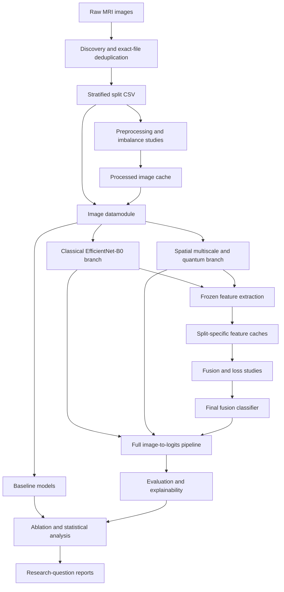
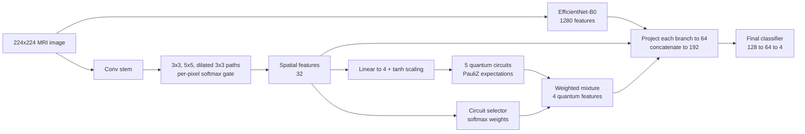

 # Brain MRI Classification with Multiscale and Quantum Feature Fusion


A configurable research pipeline for four-class brain MRI classification. It combines classical image features, spatially adaptive multiscale convolutions, simulated quantum circuits, and feature fusion.

The repository covers dataset preparation, model training, controlled comparisons, evaluation, explainability, and statistical reporting. These are organized around the experiments in the [research specification](docs/Instruction%20BY%20asif%20vai.md).

> **Research status:** The training and analysis components are implemented and covered by tests. No full-protocol study has been completed. The ablation stages (Steps 21–25) and the real-backbone preprocessing confirmation still need to be run and validated. Read [Known Limitations](#known-limitations) before running the study or interpreting its outputs.

---

## Table of Contents

- [Overview](#overview)
- [Key Features](#key-features)
- [Technology Stack](#technology-stack)
- [Architecture](#architecture)
- [Project Structure](#project-structure)
- [How the System Works](#how-the-system-works)
- [Getting Started](#getting-started)
- [Configuration](#configuration)
- [Usage](#usage)
- [Scripts and Commands](#scripts-and-commands)
- [Inputs and Outputs](#inputs-and-outputs)
- [Testing](#testing)
- [Running on Kaggle](#running-on-kaggle)
- [Out of Scope](#out-of-scope)
- [Recorded Dataset Observations](#recorded-dataset-observations)
- [Known Limitations](#known-limitations)
- [Troubleshooting](#troubleshooting)
- [Contributing](#contributing)
- [Documentation](#documentation)
- [License](#license)

---

## Overview

The task is to classify individual 2D MRI images into four classes:

| Label | Class |
|:---:|---|
| `0` | Glioma |
| `1` | Meningioma |
| `2` | Pituitary |
| `3` | No-tumor |

The project tests whether adaptive feature extraction and quantum transformations give measurable benefits over standard CNN and Transformer baselines. The quantum components are treated as experimental alternatives. Their superiority is not assumed, and a negative result is a valid outcome.

**What this repository is:** an experiment framework that produces checkpoints, feature caches, tables, figures, and reports. It is intended for researchers and developers who want to reproduce or extend the study.

**What it is not:** it has no web interface, inference API, or clinical deployment workflow. It is not a medical device.

### Research questions

- Does image preprocessing improve classification?
- Which imbalance-handling strategies improve class-wise performance?
- Does spatially adaptive multiscale fusion outperform fixed receptive fields?
- Does a learned mixture of quantum circuits add useful feature information?
- Which feature-fusion and loss formulations perform best on validation data?
- How do the models behave on external data, on degraded images, and under ablation?

---

## Key Features

- **Leak-aware data splitting:** removes exact duplicate files by MD5 hash before a stratified 70/15/15 train/validation/test split.
- **Dataset audit:** image dimensions, color mode, bit depth, intensity range, class distribution, imbalance ratio, corrupted files, and crop validation.
- **Preprocessing study:** compares anisotropic diffusion, Wiener filtering, CLAHE, adaptive gamma, and log transform. Selected recipes are cached to disk.
- **Imbalance study:** compares class weighting, focal loss (a corrected form and the legacy notebook form), weighted sampling, and augmentation.
- **Seven baselines:** a simple CNN, ResNet-50, EfficientNet-B0, ViT-B/16, Swin-T, a fixed quantum CNN, and a fixed multiscale CNN.
- **Spatially adaptive multiscale branch:** a per-pixel softmax gate over 3×3, 5×5, and dilated 3×3 convolution paths, with an 8-arm ablation.
- **Adaptive quantum branch:** a learned, per-image soft mixture of five simulated 4-qubit circuits.
- **Cached branch features** for fast training of the fusion head.
- **Three fusion strategies:** concatenation, squeeze-and-excitation (SE), and gated fusion.
- **Evaluation:** internal test, external (Figshare) test, calibration metrics (ECE, Brier score), and robustness sweeps over noise, contrast, blur, resolution, and intensity.
- **Explainability:** Grad-CAM, SHAP attribution on the fused vector, MC-dropout uncertainty, and deletion/insertion sanity checks.
- **Statistics:** McNemar, paired bootstrap, Wilcoxon, and Holm–Bonferroni correction, plus research-question mapping.
- **Resumable pipeline runner** with smoke, fast, and full profiles, built to survive Kaggle's 12-hour session limit.

---

## Technology Stack

| Area | Libraries and tools |
|---|---|
| Language | Python |
| Deep learning | PyTorch, torchvision, Lightning, TorchMetrics |
| Configuration | Hydra (`hydra-core`, `hydra-colorlog`), OmegaConf, rootutils |
| Quantum simulation | PennyLane (`default.qubit` simulator, `qml.qnn.TorchLayer`) |
| Data and statistics | NumPy, pandas, SciPy, scikit-learn |
| Imaging | Pillow, OpenCV, scikit-image, SimpleITK, h5py (Figshare `.mat` files) |
| Visualization | Matplotlib, seaborn |
| Explainability | SHAP (needed by Step 19; install it separately) |
| Optional | `umap-learn` (falls back to t-SNE if missing), experiment loggers (W&B, MLflow, Neptune, Comet, Aim, TensorBoard, CSV) |
| Development | pytest, pre-commit (black, isort, flake8, bandit, and others), GitHub Actions |
| Dataset access | Kaggle CLI |

The main dependency list is [`requirements.txt`](requirements.txt). Most versions are not pinned.

---

## Architecture

### Pipeline overview



### Proposed model



| Component | Output width | Description |
|---|---:|---|
| Classical branch | 1,280 | EfficientNet-B0 image representation |
| Spatial branch | 32 | Per-pixel gated mix of three parallel convolution paths |
| Quantum branch | 4 | Weighted mixture of circuit expectation values |
| Fused representation | 192 | Three 64-wide projections, concatenated |

**Spatial branch:** a shared stem downsamples by 4. Three paths follow: 3×3, 5×5, and dilated 3×3 (dilation 3). A small 1×1-conv gate head outputs a softmax over the three paths at every spatial location.

**Quantum branch:** the spatial features are projected to 4 values and scaled to `[-π, π]` with `tanh`. They are angle-encoded into five circuits:

| Circuit | Design |
|---|---|
| `fixed` | 2 basic entangling layers |
| `deep` | 4 basic entangling layers |
| `strong` | 2 strongly entangling layers |
| `combined` | 4 strongly entangling layers |
| `reupload` | Data re-uploading, 2 layers |

All five circuits run for every image. A selector network conditioned on the spatial features produces softmax weights that combine their outputs. It does not skip circuits or choose a single one.

Quantum computation uses PennyLane's `default.qubit` CPU simulator. This repository does not run on quantum hardware.

**Training order:** the branches are trained first (Steps 10 and 12). Their frozen features are then cached for fusion training (Steps 13–15). The spatial features in the final model come from inside the jointly trained Step 12 spatial/quantum branch. The separately trained Step 11 model is used only for the arm ablation and the gate-morphology analysis.

### Experiment stages

| Step | Purpose |
|---|---|
| 4 | Dataset audit and split preparation |
| 6 (+ confirmation) | Preprocessing proxy ranking, then real-backbone confirmation |
| 8 | Imbalance-handling comparison |
| 9 | Seven baselines |
| 10–12 | Classical branch, multiscale arms and gate morphology, adaptive quantum branch |
| 13–15 | Fusion comparison, loss selection, final classifier training |
| 16–18 | Internal, external, and robustness evaluation |
| 19–20 | Explainability and quantum contribution analysis |
| 21–23 | Ablation matrix (A0–A8 + P), statistics, research-question mapping |
| 24 | Receptive-field ablation (fixed 3×3 → 5×5 → dilated → ungated → spatial gate) |
| 25 | Fixed-circuit vs. adaptive-mixture ablation (`FIXED_BASIC`, `FIXED_DEEP`, `FIXED_STRONG`, `ADAPTIVE_QUANTUM`) |

---

## Project Structure

```text
.
├── configs/                      # Hydra configuration
│   ├── analysis/                 # One config per analysis stage (step04 … step25)
│   ├── callbacks/                # Checkpointing, early stopping, progress bar
│   ├── data/                     # bt_mri, bt_mri_proxy, bt_mri_features, figshare
│   ├── experiment/               # Experiment compositions (step06 … step25)
│   ├── loss/                     # plain_ce, weighted_ce, focal, focal_legacy
│   ├── model/                    # Baselines, branches, fusion heads, final classifier
│   ├── protocol/fixed.yaml       # Shared training protocol
│   ├── trainer/                  # cpu, gpu, mps, ddp, ddp_sim, default
│   ├── logger/                   # csv, tensorboard, wandb, mlflow, …
│   ├── train.yaml                # Entry config for src/train.py
│   ├── eval.yaml                 # Entry config for src/eval.py
│   ├── analyze.yaml              # Entry config for src/analyze.py
│   ├── extract_features.yaml     # Entry config for src/extract_features.py
│   └── prepare_dataset.yaml      # Entry config for src/prepare_dataset.py
├── data/                         # Raw data, splits, and generated caches (git-ignored)
├── docs/
│   ├── Instruction BY asif vai.md   # Research specification
│   ├── IMPLEMENTATION_PLAN.md       # Notebook-to-repository mapping
│   └── DEVIATIONS.md                # Deviation register
├── logs/                         # Hydra run outputs (git-ignored)
├── notebooks/
│   ├── kaggle_run.ipynb          # Kaggle execution wrapper (generated)
│   └── mri_thesis_notebook.ipynb # Historical reference notebook
├── scripts/
│   ├── download_data.sh          # Kaggle dataset download (Linux/macOS)
│   ├── download_data.ps1         # Kaggle dataset download (Windows)
│   ├── kaggle_pipeline.py        # Resumable end-to-end pipeline runner
│   ├── make_kaggle_notebook.py   # Regenerates notebooks/kaggle_run.ipynb
│   └── schedule.sh               # Template example of sequential runs
├── src/
│   ├── analysis/                 # Studies, evaluation, and reporting stages
│   ├── data/
│   │   ├── components/           # Splits, transforms, sampling, preprocessing, degradations
│   │   ├── bt_mri_datamodule.py          # Main image datamodule
│   │   ├── bt_mri_proxy_datamodule.py    # Reduced-scale proxy for Steps 6 and 8
│   │   ├── bt_mri_feature_datamodule.py  # Cached-feature datamodule
│   │   └── eval_datamodules.py           # Figshare external datamodule
│   ├── models/
│   │   ├── components/           # Backbones, multiscale gates, circuits, fusion, losses, Grad-CAM
│   │   ├── mri_classification_module.py  # LightningModule for image models
│   │   ├── feature_fusion_module.py      # LightningModule for fusion heads
│   │   └── full_pipeline.py              # Raw image → logits for evaluation
│   ├── utils/                    # Metrics, statistics, checkpoints, logging
│   ├── train.py                  # Training entry point
│   ├── eval.py                   # Checkpoint evaluation entry point
│   ├── analyze.py                # Analysis entry point
│   ├── extract_features.py       # Feature-cache entry point
│   └── prepare_dataset.py        # Preprocessing-mirror entry point
├── tests/                        # pytest suite
├── .github/                      # CI workflows, PR template, Dependabot
├── .env.example                  # Environment variable template
├── .pre-commit-config.yaml
├── .project-root                 # Root marker used by rootutils (do not delete)
├── environment.yaml              # Conda environment (template-era)
├── Makefile
├── pyproject.toml                # pytest and coverage settings
├── requirements.txt
├── setup.py
├── USAGE.md                      # Detailed step-by-step usage guide
└── README.md
```

> The repository also contains leftover MNIST example files from the Lightning-Hydra template (`src/data/mnist_datamodule.py`, `src/models/mnist_module.py`, `configs/model/mnist.yaml`, `configs/hparams_search/mnist_optuna.yaml`). The MRI study does not use them.

---

## How the System Works

All entry points are Hydra applications. Each run composes its configuration from `configs/`, applies command-line overrides, and writes outputs to its own directory under `logs/`.

1. **Download.** `scripts/download_data.*` fetches the primary dataset (and optionally Figshare) from Kaggle into `data/raw/`.
2. **Audit and split** (`src/analyze.py analysis=step04_audit`). Pools the vendor `Training/` and `Testing/` folders and hashes every file. It removes exact duplicates and writes a stratified split to `data/splits/dataset_split.csv`. Every later stage reads this one table.
3. **Selection studies** (Steps 6 and 8). Small proxy models on a balanced subset rank preprocessing recipes and imbalance strategies. `src/prepare_dataset.py` writes the chosen recipe to `data/processed/<recipe>/`.
4. **Training** (`src/train.py`). Hydra builds a datamodule, a `LightningModule`, callbacks, loggers, and a trainer. Image models use `MRIClassificationModule`; fusion heads use `FeatureFusionModule`.
5. **Feature caching** (`src/extract_features.py`). Loads the trained Step 10 and Step 12 checkpoints, freezes them, and saves classical, spatial, and quantum features for each split to `data/features/<tag>/`.
6. **Fusion** (Steps 13–15). Fusion heads train on the cached tensors, which takes the quantum simulator out of the training loop.
7. **Evaluation and reporting** (`src/analyze.py`, Steps 16–25). `FullPipeline` rebuilds the full image-to-logits model from three checkpoints and runs internal and external tests, robustness, explainability, ablation, and statistics.
8. **Orchestration** (`scripts/kaggle_pipeline.py`). Runs every stage in order with fixed output directories and completion markers. It passes the Step 6, 8, 13, and 14 selections on to later stages.

---

## Getting Started

### Prerequisites

- **Python 3.10 or newer.** `environment.yaml` specifies 3.10, and a comment in `requirements.txt` notes PennyLane was verified on Python 3.13.
- PyTorch and torchvision builds that work together. For full classical training, use a CUDA build.
- **A CUDA-capable GPU** for practical full-study runs. Quantum simulation always runs on CPU.
- **Kaggle API credentials** for the dataset download scripts.
- Enough disk space for datasets, processed images, checkpoints, and feature caches.

### 1. Clone the repository

```bash
git clone https://github.com/Biswadev-9/thesis.git
cd thesis
```

### 2. Install dependencies

Run these from the repository root in an activated virtual environment:

```bash
python -m pip install -r requirements.txt
python -m pip install shap          # required by the Step 19 explainability stage
```

Check the core imports and CUDA availability:

```bash
python -c "import torch, lightning, pennylane; print(torch.__version__, torch.cuda.is_available())"
```

Optional:

```bash
python -m pip install umap-learn    # UMAP projections (t-SNE is used otherwise)
python -m pip install -e .          # exposes `train_command` and `eval_command`
```

> `setup.py` declares only `lightning` and `hydra-core`, and it still has placeholder metadata. Install `requirements.txt` first. `environment.yaml` holds template-era dependencies and cannot replace `requirements.txt`. There is no separate build step.

### 3. Configure environment variables

Copy the template and fill in your values:

```bash
cp .env.example .env
```

| Variable | Required | Used by | Description |
|---|---|---|---|
| `KAGGLE_USERNAME` | For downloads (unless `~/.kaggle/kaggle.json` exists) | `scripts/download_data.*`, Kaggle CLI | Kaggle account name |
| `KAGGLE_KEY` | For downloads (unless `~/.kaggle/kaggle.json` exists) | `scripts/download_data.*`, Kaggle CLI | Kaggle API key |
| `DATA_DIR` | No (default `data`) | `scripts/download_data.sh` | Download root (PowerShell uses `-DataDir`) |
| `PROJECT_ROOT` | No | `configs/paths/default.yaml` | Set automatically by `rootutils` from the `.project-root` marker |
| `COMET_API_TOKEN`, `NEPTUNE_API_TOKEN` | Only with those loggers | `configs/logger/*.yaml` | Logger API tokens |

`.env` is git-ignored and is loaded automatically by the entry scripts. Never commit real credentials. `MY_VAR` in `.env.example` is a template placeholder, and no project config uses it.

### 4. Download the datasets

| Dataset | Kaggle slug | Location | Purpose |
|---|---|---|---|
| Primary (4 classes, 7,023 images) | `mohamadabouali1/mri-brain-tumor-dataset-4-class-7023-images` | `data/raw/bt_mri/` | Train / validation / internal test |
| External (3 tumor classes) | `ashkhagan/figshare-brain-tumor-dataset` | `data/raw/figshare/` | Step 17 external validation |

Linux/macOS:

```bash
bash scripts/download_data.sh --external   # omit --external for the primary dataset only
```

Windows PowerShell:

```powershell
.\scripts\download_data.ps1 -IncludeExternal
```

Both scripts accept a force option (`--force` / `-Force`) to download again. The expected layout is:

```text
data/
└── raw/
    ├── bt_mri/            # contains Training/ and Testing/ (may be nested inside the archive)
    └── figshare/          # .mat files
```

The loader looks inside nested archive folders for a directory that contains both `Training/` and `Testing/`, and it accepts common aliases for class-folder names. This keeps it from picking the archive's degraded `Challenging Datasets/` copy. If your layout differs, set `data.raw_subdir` explicitly.

### 5. Audit the data and build the split

```bash
python src/analyze.py analysis=step04_audit
```

This writes `data/splits/dataset_split.csv`: a stratified 70/15/15 image-level split made after exact-hash deduplication.

> This does not make the split patient-independent and does not remove near-duplicates.

There is no database in this project. The split CSV, the processed image mirrors, and the `.pt` feature caches are the only persistent data stores.

---

## Configuration

Hydra builds each run's configuration from [`configs/`](configs). Common overrides:

| Option | Purpose |
|---|---|
| `experiment=<name>` | Select an experiment composition from `configs/experiment/` |
| `model=<name>` | Select a baseline, branch, or classifier from `configs/model/` |
| `trainer=<name>` | `default`, `cpu`, `gpu`, `mps`, `ddp`, `ddp_sim` |
| `seed=<int>` | Training seed |
| `data.recipe=<name>` | Use a materialized preprocessing recipe; `null` reads raw images |
| `data.normalize=<mode>` | `imagenet`, `zscore`, `minmax`, or `none` |
| `data.batch_size`, `data.num_workers` | Loader settings (`num_workers` defaults to `0`) |
| `data.augment`, `data.use_weighted_sampler` | Training-split augmentation and balanced sampling |
| `test=<bool>` | Run the test set after training (**defaults to `True`**) |
| `logger=<name>` | `csv`, `tensorboard`, `wandb`, `mlflow`, `neptune`, `comet`, `aim`, `many_loggers` |
| `debug=<name>` | `default`, `fdr`, `limit`, `overfit`, `profiler` |

The default MRI input is 224×224 with ImageNet normalization. Background cropping is off by default.

### Fixed training protocol

[`configs/protocol/fixed.yaml`](configs/protocol/fixed.yaml) defines the shared protocol:

| Setting | Value |
|---|---|
| Optimizer | AdamW |
| Learning rate | `1e-4` |
| Weight decay | `1e-4` |
| Scheduler | Cosine annealing (`T_max` = max epochs) |
| Batch size | `32` |
| Maximum epochs | `30` |
| Early-stopping patience | `12` |
| Selection metric | `val/f1_macro` |
| Full-run seeds | `42`, `123`, `7` |

Running `python src/train.py` with no arguments does **not** apply this protocol (`protocol: null` by default). Use one of the experiment configs that includes it.

> **Test-set access:** `configs/train.yaml` defaults to `test: True`. The training examples below pass `test=false` so the test set is not touched during development.

---

## Usage

### Option A: Run the pipeline with one command

[`scripts/kaggle_pipeline.py`](scripts/kaggle_pipeline.py) runs every stage in order. It pins output directories, skips completed stages, resumes training from `last.ckpt`, and passes upstream selections on to later stages.

```bash
python scripts/kaggle_pipeline.py --list --profile full   # print the stage graph; runs nothing
python scripts/kaggle_pipeline.py --profile smoke         # quick wiring check
python scripts/kaggle_pipeline.py --profile full          # intended study run
```

| Profile | Behavior | Output root | Reportable |
|---|---|---|:---:|
| `smoke` | 1 epoch, 3 batches per split, seed 42, 20-min stage timeout | `logs/_smoke/` | No |
| `fast` (**default**) | Max 8 epochs, patience 4, seed 42 | `logs/_fast/` | No |
| `full` | Fixed protocol, seeds 42, 123, 7 | `logs/` | Yes |

Frequently used options:

| Option | Description |
|---|---|
| `--only`, `--from`, `--until`, `--skip` | Select stages by id, group (e.g. `step13`), or prefix |
| `--seeds 42,123` | Override the profile's seeds |
| `--budget-hours 11` | Wall-clock budget (default 11 h) |
| `--accelerator {auto,gpu,cpu}` | Device for classical stages |
| `--quantum-accelerator {cpu,gpu}` | Device for quantum stages (default `cpu`) |
| `--num-workers N` | Dataloader workers (default `0`) |
| `--recipe`, `--imbalance`, `--loss` | Force a selection instead of reading it from a study |
| `--confirm-recipes`, `--confirm-top-k`, `--confirm-seeds` | Control the Step 6 real-backbone confirmation |
| `--force` | Re-run stages already marked done |
| `--force-test` | Override the once-only Step 16 test lock (recorded in the summary) |
| `--keep-going` | Continue past failing stages |
| `--restore-from DIR` | Copy a previous session's logs and caches in before running |
| `--setup-data` | Find attached Kaggle datasets, link them into `data/raw/`, then exit |
| `--no-bundle`, `--bundle-to DIR` | Control the results archive |

Exit codes: `0` finished, `1` a required stage failed, `2` time budget used up (re-run the same command to continue), `130` interrupted.

Choosing a stage does **not** run its missing prerequisites automatically.

### Option B: Run stages manually

#### Selection studies

```bash
python src/analyze.py analysis=step06_preprocessing
python src/analyze.py analysis=step08_imbalance
python src/prepare_dataset.py recipe=clahe     # example: materialize a recipe into data/processed/clahe
```

The Step 6 proxy only ranks candidates; real-backbone confirmation is a separate stage (`analysis=step06_confirm`). The CLAHE command only shows how to materialize a recipe. It does not mean CLAHE is the chosen treatment.

#### Baselines (Step 9)

```bash
python src/train.py experiment=step09_baselines model=baseline_simple_cnn seed=42 logger=csv test=false

python src/train.py experiment=step09_baselines model=baseline_efficientnet_b0 \
    trainer=gpu seed=42 logger=csv test=false

# three-seed sweep
python src/train.py -m experiment=step09_baselines model=baseline_efficientnet_b0 \
    seed=42,123,7 trainer=gpu logger=csv test=false
```

Available baseline models: `baseline_simple_cnn`, `baseline_resnet50`, `baseline_efficientnet_b0`, `baseline_vit`, `baseline_swin`, `baseline_fixed_qcnn`, `baseline_fixed_multiscale`.

#### Feature branches (Steps 10–12)

```bash
python src/train.py experiment=step10_classical seed=42 logger=csv test=false
python src/train.py experiment=step12_adaptive_quantum seed=42 logger=csv test=false
```

Use the same preprocessing settings for training, feature extraction, and evaluation.

#### Feature extraction and fusion (Steps 13–15)

```bash
python src/extract_features.py \
    classical_ckpt=logs/train/runs/<step10 run> \
    quantum_ckpt=logs/train/runs/<step12 run>

python src/analyze.py analysis=step13_fusion analysis.tag=default
python src/analyze.py analysis=step14_loss_selection analysis.tag=default
```

The final model uses `experiment=step15_final_protocol`, and its loss must match the Step 14 decision. The runner handles this automatically:

```bash
python scripts/kaggle_pipeline.py --profile full --only features
python scripts/kaggle_pipeline.py --profile full --only step15
```

#### Evaluation (Steps 16–17)

```bash
python scripts/kaggle_pipeline.py --profile full --only step16_internal
python scripts/kaggle_pipeline.py --profile full --only step17_external   # needs the Figshare data
```

Step 16 writes a `test_evaluated.lock` to stop that analysis from running the test set twice. Generic training, `src/eval.py`, and other analyses do not check this lock.

[`src/eval.py`](src/eval.py) evaluates a single checkpoint on the test split. `ckpt_path` is required, and `model`/`data` must match the checkpoint:

```bash
python src/eval.py model=baseline_simple_cnn ckpt_path=<path/to/checkpoint.ckpt>
```

For a detailed walkthrough of every step, see [USAGE.md](USAGE.md).

---

## Scripts and Commands

### Entry points

| Command | Purpose |
|---|---|
| `python src/train.py [overrides]` | Train a model (`-m` for multirun sweeps) |
| `python src/eval.py ckpt_path=… [overrides]` | Evaluate a checkpoint on the test split |
| `python src/analyze.py analysis=<stepXX_…>` | Run one analysis stage |
| `python src/extract_features.py classical_ckpt=… quantum_ckpt=…` | Build a feature cache |
| `python src/prepare_dataset.py recipe=<name>` | Materialize a preprocessing recipe |
| `python scripts/kaggle_pipeline.py [options]` | Run the orchestrated pipeline |
| `python scripts/make_kaggle_notebook.py` | Regenerate `notebooks/kaggle_run.ipynb` |

Analysis configs: `step04_audit`, `step06_preprocessing`, `step06_confirm`, `step08_imbalance`, `step10_embeddings`, `step11_gate_morphology`, `step13_fusion`, `step14_loss_selection`, `step16_internal`, `step17_external`, `step18_robustness`, `step19_explainability`, `step20_quantum_advantage`, `step21_ablation`, `step22_rq_mapping`, `step23_statistics`, `step24_receptive_field`, `step25_quantum_circuit_ablation`.

### Makefile

| Target | Command |
|---|---|
| `make help` | List targets |
| `make clean` | Remove caches and build artifacts |
| `make clean-logs` | Delete `logs/` contents |
| `make format` | `pre-commit run -a` |
| `make test` | `pytest -k "not slow"` |
| `make test-full` | `pytest` |
| `make train` | `python src/train.py` (default config: simple CNN, test enabled) |

---

## Inputs and Outputs

| Artifact | Location |
|---|---|
| Primary images | `data/raw/bt_mri/` |
| External images | `data/raw/figshare/*.mat` |
| Split table | `data/splits/dataset_split.csv` |
| Processed images | `data/processed/<recipe>/` (+ `recipe_manifest.json`) |
| Feature caches | `data/features/<tag>/{train,val,test}.pt` (+ `manifest.json`) |
| Single runs | `logs/<task>/runs/<timestamp>/` |
| Multiruns | `logs/<task>/multiruns/<timestamp>/` |
| Runner stages | Fixed directories, e.g. `logs/train/runs/step15_final/seed_42/` |
| Runner state | `<log root>/pipeline/manifest.json`, `REPORT.md`, `.pipeline_done.json` markers |
| Results bundle | `thesis_results_<timestamp>.zip` |

Training runs save checkpoints, the resolved config, and logs. Analyses write JSON summaries, CSV tables, and figures. The results bundle contains only lightweight files (JSON, CSV, PNG, Markdown, YAML, logs, SVG, PDF). It leaves out checkpoints and tensor caches, so you cannot restore training from the bundle alone.

---

## Testing

The test suite uses **pytest**. Settings are in [`pyproject.toml`](pyproject.toml) and include `--doctest-modules` and a `slow` marker.

```bash
python -m pytest tests/ -q                  # full suite
python -m pytest tests/ -m "not slow" -q    # skip tests marked slow
```

The tests cover data splitting and leakage, transforms, preprocessing, losses, model shapes and gradients, branches, fusion, configuration and protocol consistency, checkpoints, resume safety, orchestration, evaluation, explainability, ablation matrices, and statistics.

Some tests train models, use synthetic data, or need optional dependencies, existing data, or a GPU. Skipping slow tests does not make the run fully self-contained.

**Continuous integration:** `.github/workflows/test.yml` runs `pytest` on Ubuntu, macOS, and Windows, and uploads coverage to Codecov. Code-quality workflows run `pre-commit`.

---

## Running on Kaggle

The project has no server deployment. The supported remote execution target is a Kaggle notebook:

1. Open [`notebooks/kaggle_run.ipynb`](notebooks/kaggle_run.ipynb) on Kaggle with a GPU accelerator and internet enabled.
2. Attach the primary dataset (and optionally Figshare) as inputs.
3. Set `PROFILE` in the settings cell (`smoke`, `fast`, or `full`) and use **Run All**.
4. The notebook clones the repository, installs the missing packages, links the datasets (`--setup-data`), runs the tests, runs the pipeline, and writes a results bundle.
5. To resume after the 12-hour limit, use **Save Version**, attach that output as an input next session, and run again. Finished stages are skipped.

The notebook is generated from `scripts/make_kaggle_notebook.py`. Edit that script, not the `.ipynb`. Some of the notebook's guidance is out of date (see [Known Limitations](#known-limitations)).

---

## Out of Scope

These are not part of this repository:

- **REST/HTTP API:** none. Everything runs from the command line.
- **Authentication and authorization:** none. The only credentials are Kaggle API keys (and optional logger tokens) used by external tools.
- **Database:** none. Data lives in files (see [Inputs and Outputs](#inputs-and-outputs)).
- **Web/production deployment:** none. Docker files and serving code are not included.

---

## Recorded Dataset Observations

The [reference notebook](notebooks/mri_thesis_notebook.ipynb), [USAGE.md](USAGE.md), and [docs/DEVIATIONS.md](docs/DEVIATIONS.md) record these dataset properties:

| Property | Recorded value |
|---|---:|
| Images before deduplication | 7,023 |
| Unique images after exact deduplication | 6,597 |
| Train / validation / test | 4,617 / 990 / 990 |
| Image dimensions | 224×224 |
| Color mode / bit depth | RGB / 8-bit |

These numbers come from earlier runs. This README does not verify them again.

Earlier pipeline result bundles (`thesis_results_*`) are git-ignored and **not included** in this repository. **This repository does not establish any full-protocol performance benchmark or any quantum-advantage claim.** Do not report smoke or fast runs as thesis results.

---

## Known Limitations

### Experimental validity

- **Test access is not globally sealed.** Training runs the test set after fitting by default, and some earlier analyses read the test split.
- **Preprocessing decisions are applied inconsistently.** The main training stages use the proxy selection, while Steps 24–25 require the real-backbone confirmation.
- **The final classifier always uses concatenation.** If gated or SE fusion wins in Step 13, the final fusion architecture does not change.
- **Splits are not grouped by patient.** Exact-file deduplication does not handle related slices, near-duplicates, or overlap between the primary and external datasets.
- **The imbalance proxy is balanced by construction.** Because it samples classes equally, it says little about imbalance in the original dataset.
- **Final-head seeds share cached branch features.** They are not independent retrainings of the whole pipeline.
- **Some ablations change more than one factor or differ in capacity.** Conclusions should account for this.

### Execution and reproducibility

- Confirmation stages are built before a fresh proxy run produces its ranking. On a fresh workspace, a single invocation can fail at confirmation. Re-run it after the ranking exists, or pass `--confirm-recipes`.
- With `--keep-going`, failed stages may not change the final exit code. The Kaggle notebook does not stop when tests fail.
- Completion markers do not fully check configuration, code, dataset, checkpoint, or cache provenance.
- Stage resumption does not fully check that processed images and feature caches exist.
- The `a6_diffusion` ablation feature tag is shared across profiles.
- Dependencies are not fully pinned. The Conda file, package metadata, and MNIST examples are still template content.
- The CI matrix includes Python 3.8, which the code does not support (it uses `str.removesuffix`, which needs Python 3.9 or newer). Some CI tests also need data or artifacts the workflow does not provide.

### Evaluation and reporting

- External and robustness evaluation do not always apply the selected preprocessing.
- Attention-rollout helpers exist in `src/models/components/explain.py` but the explainability study does not use them.
- Morphology analysis uses threshold-derived proxy regions, not verified tumor masks.
- Cached-feature timing does not include the full cost of quantum-simulator inference.
- Some statistical pairing checks compare labels without sample identifiers.
- The earlier research-question report does not include Steps 24–25.

See [docs/DEVIATIONS.md](docs/DEVIATIONS.md) for documented decisions and open items.

---

## Troubleshooting

| Symptom | Likely cause | Fix |
|---|---|---|
| `Raw dataset not found at …` | Dataset not downloaded, or nested in an unexpected place | Run the download script, or set `data.raw_subdir=raw/bt_mri/<subfolder>` |
| `Split table not found at …` | Step 4 not run | `python src/analyze.py analysis=step04_audit` |
| `Image root not found … Materialise recipe` | `data.recipe` set but mirror missing | `python src/prepare_dataset.py recipe=<name>` |
| `Step 15 needs the loss Step 14 selected` | Step 14 not run | Run `step14_loss_selection`, or pass `--loss` |
| `ModuleNotFoundError: shap` during Step 19 | SHAP is not in `requirements.txt` | `pip install shap` |
| `<role> checkpoint is required` from `extract_features.py` | Missing `classical_ckpt` / `quantum_ckpt` | Pass both run directories or `.ckpt` files |
| Quantum stages are very slow | Five circuits are simulated on CPU for every image | Expected. Keep `--quantum-accelerator cpu` and use cached features for fusion |
| Dataloader hangs with workers > 0 | Little shared memory (common on Kaggle) | Keep `num_workers=0` (the default) |
| Runner exits with code `2` | Time budget used up | Re-run the same command; finished stages are skipped |
| `kaggle` CLI not found | Not installed | `pip install kaggle` |

---

## Contributing

1. Create a feature branch from `main`.
2. Keep changes focused and fill in the [pull request template](.github/PULL_REQUEST_TEMPLATE.md).
3. Run the tests and the configured hooks before opening a PR:

   ```bash
   python -m pytest tests/ -q
   pre-commit run -a      # some hooks modify files
   ```

4. Changes to the fixed protocol, splits, preprocessing, or model-selection rules can invalidate downstream results. Record methodological changes in [docs/DEVIATIONS.md](docs/DEVIATIONS.md) and regenerate the affected artifacts.
5. Never commit dataset credentials, `.env` files, or other secrets.

---

## Documentation

- [Research specification](docs/Instruction%20BY%20asif%20vai.md): the source of truth for the study design
- [Implementation plan](docs/IMPLEMENTATION_PLAN.md): how the reference notebook maps onto this repository
- [Deviation register](docs/DEVIATIONS.md): deliberate departures and open items
- [Detailed usage guide](USAGE.md): step-by-step commands (some passages describe older states)
- [Historical research notebook](notebooks/mri_thesis_notebook.ipynb)
- [Kaggle execution notebook](notebooks/kaggle_run.ipynb)

The training scaffold is based on the [Lightning-Hydra-Template](https://github.com/ashleve/lightning-hydra-template).

---

## License

The repository does not include a license file. Without one, default copyright applies. Contact the author before reusing or redistributing the code.
